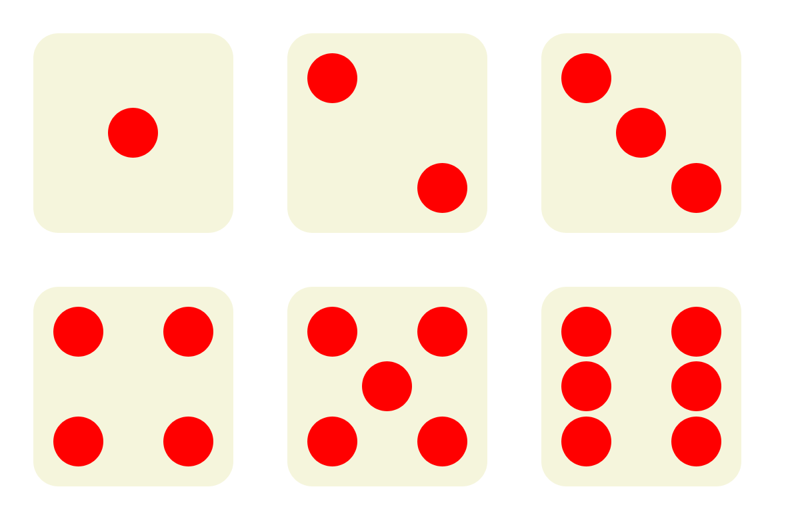

# Exercice HTML/CSS : Affichage de Dés de 1 à 6

## Objectif
L'objectif de cet exercice est de créer une interface HTML/CSS qui affiche des dés avec des points correspondant aux numéros de 1 à 6. Vous utiliserez des sélecteurs CSS, ainsi que les positions absolue et relative pour positionner les points sur les dés.

## Consignes

1. **Structure HTML** :
   - Créez un fichier `index.html`.
   - Ajoutez une structure de base HTML5.

2. **Styles CSS** :
   - Créez un fichier `styles.css`.
   - Utilisez les sélecteurs CSS pour styliser les dés et les points.
   - Utilisez la position relative et absolute pour les dés et les points.
